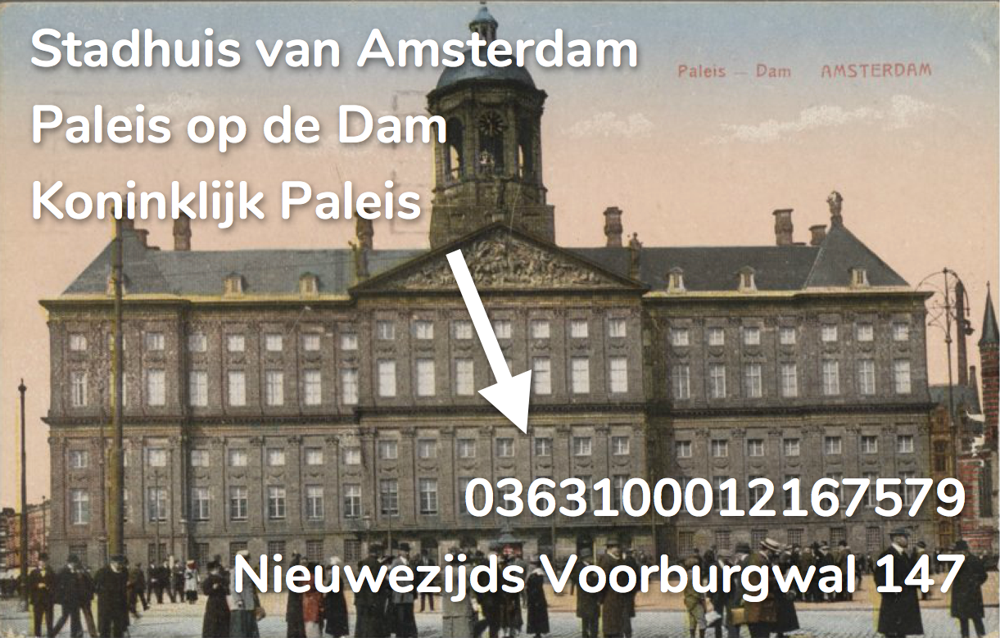

# Amsterdam Building Names (ABN)

_A list of (historic) names for Amsterdam buildings, each name connected to either BAG or Verdwenen Gebouwen_

The Basisadministratie Adressen en Gebouwen (BAG) holds geometries for every building in the Netherlands. While providing nice identifiers for and information on these buildings (like addresses within a building and building years), the BAG doesn't know any names.

The ABN list connects building names to BAG identifiers (pand id) for buildings that still exist.

Buildings that disappeared from the Amsterdam cityscape might be found in the Verdwenen Gebouwen dataset. The ABN list frequently imports names from this set.